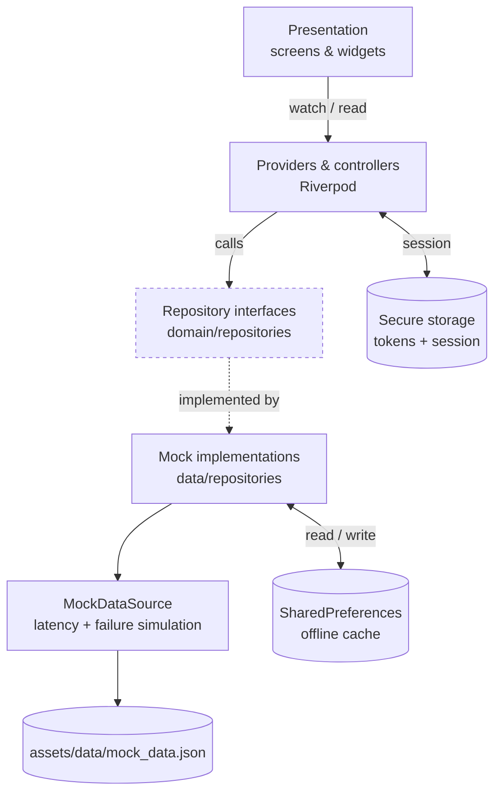
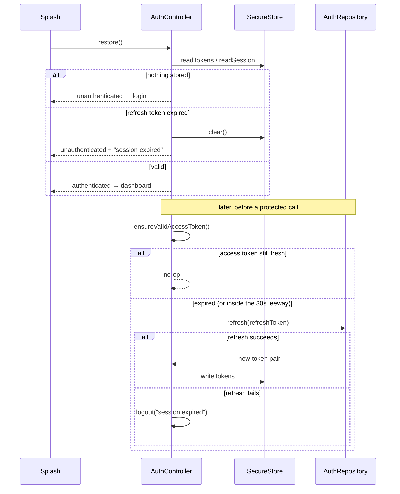

# TaskFlow — Architecture

A practical layered architecture: enough structure to keep business logic out of widgets and to
allow swapping the fake backend for a real one, without abstractions that earn nothing.

---

## Layers



The presentation layer depends only on the repository **interfaces**. `MockProjectRepository`
could be replaced by an `ApiProjectRepository` by changing one line in `providers.dart`.

### Layer responsibilities

| Layer | Owns | Never does |
|---|---|---|
| `presentation/` | Layout, interaction, rendering state | Parse JSON, enforce rules, decide what is authorized |
| Providers/controllers | Fetching, mutations, authorization calls, filtering, session | Build widgets |
| `domain/` | Entities, repository contracts, permission rules, the task filter | Know about JSON, Flutter, or storage |
| `data/` | JSON mapping, the fake backend, the offline cache | Know about widgets |
| `core/` | Theme, router, storage, errors, formatting, validation | Hold feature logic |

---

## Data flow

A read, end to end:

```
TasksScreen
  └─ ref.watch(tasksProvider)
       └─ ensureValidAccessToken()        refresh first if the token is stale
       └─ taskRepository.list(session)
            ├─ dataSource.tasksOf(orgId)  latency + simulated failure applied here
            │    └─ in-memory rows from the parsed asset
            ├─ on success → write to the offline cache
            └─ on failure → serve the cached copy, or rethrow if the cache is cold
```

A write, end to end:

```
TaskFormScreen
  └─ taskController.create(...)
       ├─ set isBusy → the submit button locks
       ├─ ensureValidAccessToken()
       ├─ taskRepository.create(session, ...)
       │    ├─ requireSameOrg   the project must belong to the caller's org
       │    ├─ requireAssigneeInOrg   the assignee must be a member of it
       │    └─ dataSource.createTask(...)
       ├─ invalidate tasks / projects / notification providers
       └─ return MutationResult → the form shows a snackbar or field errors
```

Every mutation invalidates the providers it can affect, so lists, the owning project's derived
task count, and the notification badge all refresh without manual plumbing.

---

## State management

Riverpod, with three kinds of provider:

- **`Provider`** for composition-root wiring (repositories, storage, the clock) and cheap
  derived values (`isOfflineProvider`, `unreadNotificationCountProvider`).
- **`FutureProvider.autoDispose`** for reads. Screens render `.when(loading:, error:, data:)`,
  which is what makes the loading / error / success states uniform.
- **`StateNotifierProvider`** for the session and for the mutation controllers, whose state is a
  simple `bool` "is a write in flight" that forms use to lock their submit buttons.

The empty state is not a separate provider state — it is `data:` with an empty list, which
screens render as an `EmptyState` widget. Adding a fourth case would duplicate what the list
length already says.

`clockProvider` injects "now" so due-date, overdue, and token-expiry behaviour can be tested
deterministically.

---

## Authentication and the token lifecycle



Details that matter:

- The mock backend returns **relative** lifetimes (900s access, 604800s refresh). They are
  converted to **absolute** instants at issue time, so expiry survives an app restart.
- A **30-second leeway** means a token that is about to expire is refreshed before the call
  rather than mid-flight.
- **Concurrent callers share one refresh.** `_inFlightRefresh` is a single future, so a burst of
  requests cannot trigger a burst of refreshes.
- **Logout clears everything**: tokens, session, and every cached organization payload — so a
  second user on the same device never sees the first user's data.
- `AuthTokens.toString()` is overridden to redact both token values; a test asserts it.
  Passwords are never persisted anywhere.

### Surviving the logout frame

On logout, the authenticated screens rebuild once more before the router redirect unmounts them.
`sessionProvider` retains the last non-null session for exactly that frame; without it, thirteen
screens would throw on a null read and the user would see a crash instead of the login screen.
An integration test covers this.

---

## Navigation

`go_router` with one `redirect` that owns every auth rule:

| Auth status | On an auth route | Anywhere else |
|---|---|---|
| `unknown` (session still loading) | → splash | → splash |
| `unauthenticated` | stay | → login |
| `authenticated` | → dashboard | stay |

A `ChangeNotifier` bridges auth-status changes to the router's `refreshListenable`, so a logout
anywhere in the app re-evaluates the redirect immediately.

The four primary sections live under a `ShellRoute` that renders the bottom navigation
(or a navigation rail at ≥720dp). Forms and full-screen destinations sit **outside** the shell so
they present without the nav bar.

---

## Authorization

Three rules, all in `domain/entities/permissions.dart`, all enforced in the repositories:

1. **Only `org_admin` may delete a project** — `requireAdmin`.
2. **Records must belong to the caller's organization** — `requireSameOrg`, applied to project
   and task reads, updates, and deletes.
3. **An assignee must be a member of the caller's organization** — checked against
   `org_members`, on create, update, and assign.

The UI additionally hides actions a user cannot perform, but that is defence in depth, not the
boundary. `test/unit/authorization_test.dart` calls the repositories directly, bypassing the UI
entirely, to prove a member cannot delete a project and cannot reach the other tenant's data.

---

## Error handling

A sealed `AppException` hierarchy, each carrying a message written for the person using the app:

```
AppException
├── NetworkException / TimeoutException / OfflineException
├── ServerException / NotFoundException
├── UnauthorizedException / InvalidCredentialsException / ForbiddenException
└── ValidationException (with per-field messages)
```

- Widgets call `messageFor(error)` and never render a raw exception.
- Reads surface through `AsyncValue.error` → `ErrorStateView` with a retry button.
- Writes return a `MutationFailure` so the form can show a snackbar and inline field errors.
- A `ValidationException`'s `fieldErrors` map is merged into the form's validators, so a
  server-side rejection highlights the offending field.

---

## Offline handling

`MockDataSource._simulate` gates every call:

- **Offline + write** → `OfflineException`, so the user is told the change was not saved.
- **Offline + read** → `NetworkException`, which the repository catches and answers from the
  per-organization cache. A cold cache rethrows, and the screen shows the error state with retry.

Successful list reads are written to `SharedPreferences` under a per-organization key, together
with a `cached_at` timestamp that the offline banner turns into "showing data from 5m ago".
A cache written by an older schema fails to parse, is dropped, and is treated as "no cache"
rather than crashing a screen.

---

## Testing strategy

175 tests, none of which touch a network.

| Level | Location | Covers |
|---|---|---|
| Unit | `test/unit/` | Token expiry and refresh, forced logout, filtering across every dimension, validators and formatters, authorization and tenant isolation, repository behaviour, error simulation, offline fallback, derived statistics, JSON parsing of the shipped asset |
| Widget | `test/widget/` | Login validation and submission, task list loading / empty / error / success, status update through the UI, the offline banner, layout without overflow at several sizes |
| Integration | `test/integration/` | Splash → login → dashboard, project and task listing, create and update a task, assignment, logout, and session restore, driven through the real router and screens |

Key harness decisions (`test/support/harness.dart`):

- The **real asset is loaded from disk once** and handed to the data source as a
  `SynchronousFuture`, so widget tests resolve without real I/O — `pump` cannot drive a disk read.
- **Zero latency skips the timer entirely.** A pending zero-duration timer would outlive a test's
  fake clock and fail it; the data source only creates a timer when the delay is positive.
- **`signInWidget`** pumps the fake clock while signing in. A bare `await signIn(...)` inside
  `testWidgets` deadlocks, because the data source awaits a timer that only advances on pump.
- **No `pumpAndSettle`.** The skeleton shimmer repeats forever, so the frame loop never idles.

Two real bugs were found by these tests and fixed: a `RenderFlex` overflow on the login screen
at narrow widths, and the null-session crash on logout described above.

---

## What a real backend would change

Almost nothing above the data layer:

1. Write `ApiTaskRepository implements TaskRepository` (and siblings) against HTTP.
2. Swap the implementation in `providers.dart`.
3. Move the authorization guards server-side — keeping the client checks as UX, not as the
   boundary.
4. Attach the access token to requests and map HTTP status codes onto the existing
   `AppException` types, which the UI already renders correctly.

The entities, providers, screens, filtering, offline cache, and error handling stay as they are.
